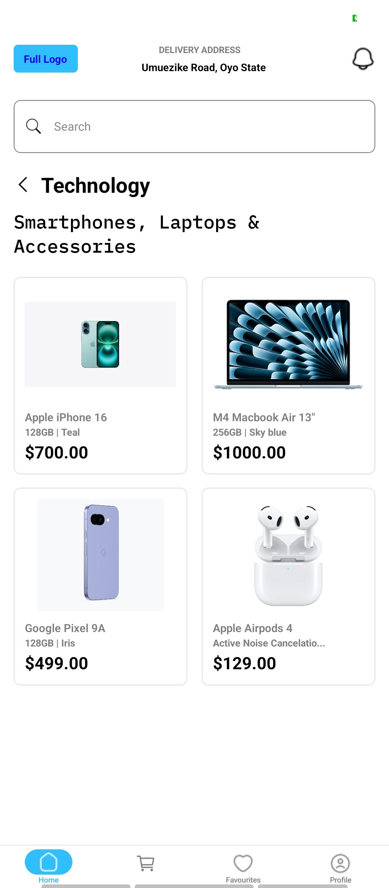
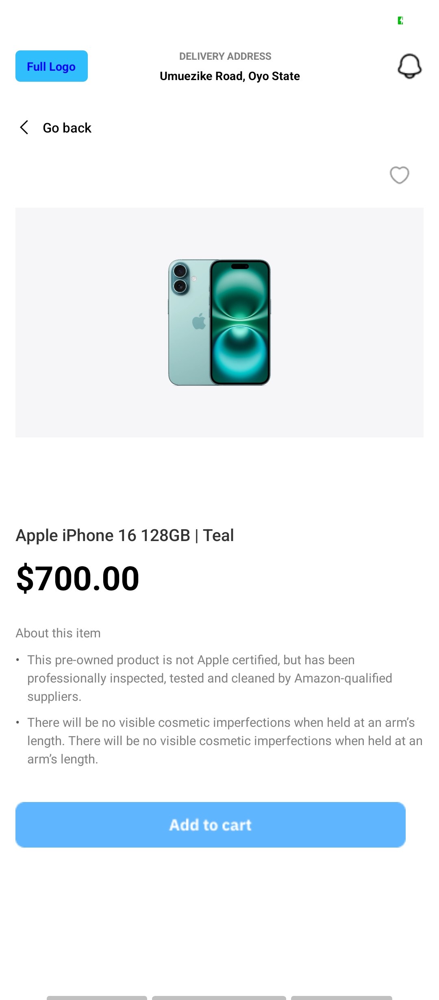
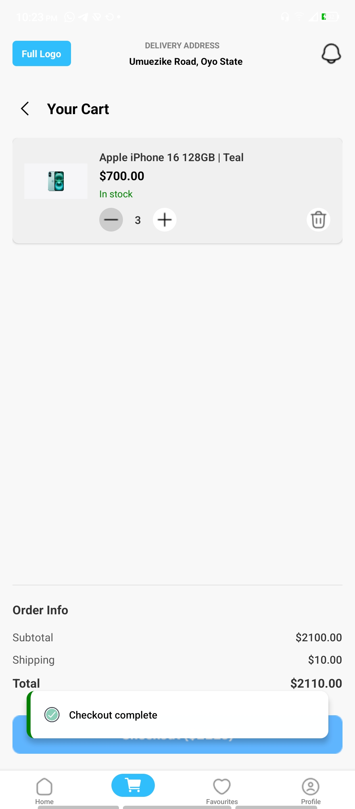
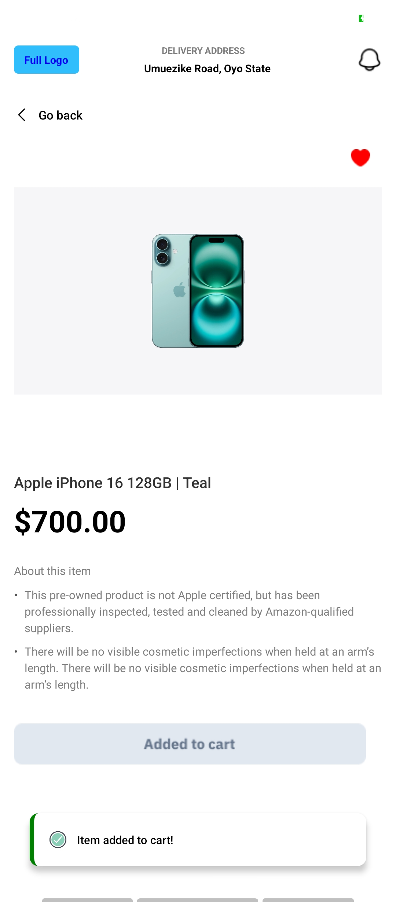

# E-Commerce App

## 📱 Screens
- Home Screen
- Product Screen
- Cart Screen

## 🛠 Tech Stack
- React Native
- Expo (or Bare React Native)
- React Navigation
- React Native Reanimated (if used)

## 🚀 How to Run the App
1. Clone this repo
2. Run `npm install`
3. Start the app:
   - If using Expo: `npx expo start`
   - If using bare React Native: `npx react-native run-android`

## 📸 Screenshots

### Home Screen

### Product Screen

### Cart Screen

### Favourite Image Pressed Screen

### Item Added With Toast Message Pop-Up
